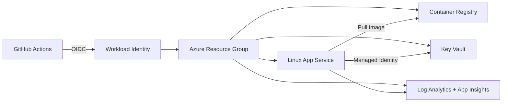

# Cloud Platform IaC Showcase

> **Sanitized engineering portfolio.** This repository demonstrates cloud-platform patterns adapted from private production work. All customer information, credentials, subscription IDs, internal resource names, private endpoints, and proprietary configuration have been removed.

A reference **Azure platform foundation** implemented with Terraform and designed around secure identity, observability, least privilege, repeatability, and CI validation.

## What this demonstrates

- Infrastructure as Code with Terraform
- Azure resource naming and environment conventions
- OIDC / Managed Identity patterns
- Key Vault for secret references rather than secrets in source control
- Container Registry + Linux App Service runtime
- Log Analytics + Application Insights observability
- GitHub Actions validation pipeline
- Explicit separation between configuration and sensitive values

## Architecture



## Repository layout

```text
terraform/
  versions.tf
  variables.tf
  locals.tf
  main.tf
  outputs.tf
  terraform.tfvars.example
docs/
  security.md
.github/workflows/
  terraform-ci.yml
```

## Validate locally

```bash
cd terraform
terraform init -backend=false
terraform fmt -check -recursive
terraform validate
```

## Design principles

1. No long-lived cloud credentials in source control.
2. Secrets are references, not configuration literals.
3. Managed identity is preferred over access keys.
4. Observability is provisioned with the workload.
5. Naming and tags are deterministic.
6. CI validates formatting and configuration before merge.

This is intentionally concise. A production platform would normally add remote state, private networking, policy, backup/restore, DR, cost budgets, WAF/API management, and environment promotion workflows.
